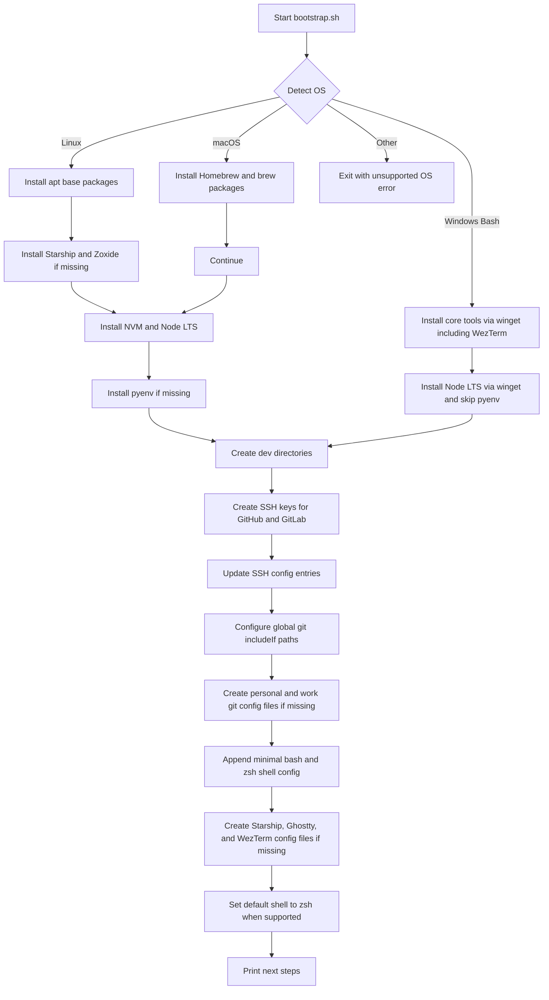

# dev-bootstrap

Cross-platform dev environment bootstrap for Linux, macOS, and Windows Bash environments.

This project sets up a reusable terminal-first workflow with:
- shell tooling (bash/zsh, starship, fzf, zoxide)
- language runtimes (Node LTS via nvm, pyenv)
- git identity split (personal vs work)
- SSH key generation for GitHub and GitLab
- terminal config stubs for Ghostty and WezTerm

## What it does

The script in [bootstrap.sh](bootstrap.sh):
- detects your OS and installs required base packages
- installs optional tools only if they are missing
- supports Linux, macOS, and Windows shell environments (Git Bash/MSYS/Cygwin)
- configures SSH keys and SSH host identities
- configures git includeIf profiles for separate personal/work identity
- appends minimal shell settings without clobbering existing bash/zsh setup
- creates starter config files only when they do not already exist

The script is designed to be rerunnable and safe for iterative setup.

## Setup Flow

## Usage

1. Make the script executable:

	chmod +x bootstrap.sh

2. Run it:

	./bootstrap.sh

3. Follow the printed next steps:
- restart terminal
- add generated public keys to GitHub and GitLab
- update placeholder emails in your git profile files

## Platform notes

- Linux: uses apt for base packages.
- macOS: uses Homebrew.
- Windows Bash (Git Bash/MSYS/Cygwin): uses winget for package installs, including WezTerm.
- Native Windows skips NVM and pyenv in this script path.

## Files created or updated

The script may create or update:
- ~/.ssh/config
- ~/.gitconfig
- ~/.gitconfig-personal
- ~/.gitconfig-work
- ~/.zshrc
- ~/.config/starship.toml
- ~/.config/ghostty/config
- ~/.wezterm.lua

It avoids overwriting existing files for the profile-specific and terminal config stubs.
